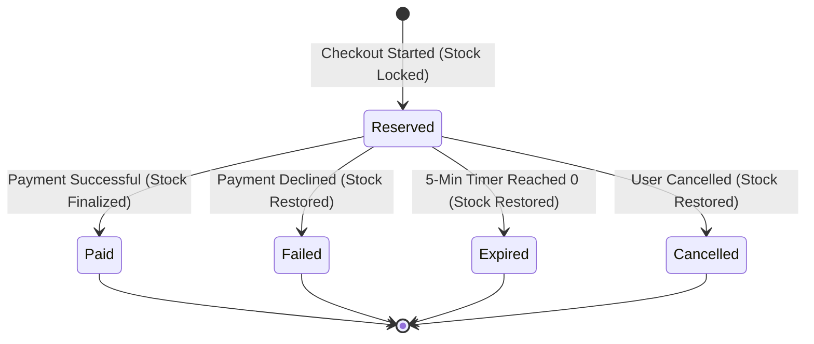

# Deployement Link : 
http://pos-order-inventory-system-production-5e56.up.railway.app/


# 🚀 Concurrency-Safe POS Order & Inventory System

A production-grade, concurrency-safe Point-of-Sale (POS) system built with **Express.js**, **PostgreSQL**, and a modern **React (Vite + Tailwind CSS)** frontend. 

The system features **atomic stock reservations**, **compensating rollback transactions**, a **dual-layer 5-minute reservation expiry engine**, **mock payment processing with idempotency guards**, **role-based user authentication (User & Admin)** with **admin-only user registration**, **LKR currency formatting**, and an interactive **real-time race condition stress simulator**.

---

## 📑 Table of Contents

- [Key Highlights](#-key-highlights)
- [System Architecture](#️-system-architecture)
- [Concurrency & Overselling Prevention](#-concurrency--overselling-prevention)
- [Order Lifecycle & 5-Minute Stock Lock](#-order-lifecycle--5-minute-stock-lock)
- [Authentication & Role-Based Access Control](#-authentication--role-based-access-control)
- [Mock Payment Gateway & Idempotency](#-mock-payment-gateway--idempotency)
- [Currency Formatting (LKR)](#-currency-formatting-lkr)
- [REST API Reference](#-rest-api-reference)
- [Automated Testing & Concurrency Verification](#-automated-testing--concurrency-verification)
- [Local Setup & Getting Started](#-local-setup--getting-started)
- [Production Deployment (Docker & Cloud)](#-production-deployment-docker--cloud)

---

## 🌟 Key Highlights

- **Zero-Overselling Concurrency Engine**: Guaranteed stock safety using PostgreSQL atomic conditional updates (`WHERE available_stock >= qty RETURNING *`).
- **5-Minute Stock Reservation**: Items added to checkout are temporarily reserved for 300 seconds. Abandoned reservations auto-expire via a background cron worker or lazy on-access checks.
- **Role-Based Authentication (User vs. Admin)**:
  - Secure password hashing via Node.js built-in `crypto.pbkdf2Sync` (SHA-512, 10,000 iterations, 16-byte random salt).
  - Tamper-proof HMAC-SHA256 bearer tokens.
  - **Admin-Exclusive Signup**: Only administrators can register new user accounts; all credentials and permissions are persisted in PostgreSQL.
- **Idempotent Payment Processing**: Prevents double-billing using unique `idempotencyKey` indexing with simulated outcomes (`success`, `failure`, `timeout`).
- **Dismissible Checkout Modal**: Easily close or return to the storefront after paying or cancelling reservations.
- **Localized Sri Lankan Rupee (LKR)**: All catalog items, cart subtotals, order ledgers, and checkout totals are formatted as `LKR X,XXX.XX`.
- **Zero-Config Embedded Database**: Automatically starts embedded **PGlite** (PostgreSQL in WASM) if no `DATABASE_URL` is provided. Zero setup needed for local development!

---

## 🏗️ System Architecture

```
                          ┌─────────────────────────────────────────┐
                          │       React POS Frontend (Vite)         │
                          │   Storefront • Cart • Orders • Users    │
                          └───────────────────┬─────────────────────┘
                                              │ HTTPS / JSON (Bearer Token)
                                              ▼
                          ┌─────────────────────────────────────────┐
                          │           Express.js REST API           │
                          │  Auth • Products • Orders • Payments    │
                          └───────┬──────────────────────┬──────────┘
                                  │                      │
                  ┌───────────────▼──────────┐   ┌───────▼─────────────────┐
                  │     InventoryService     │   │   5-Min Expiry Worker   │
                  │ Atomic $gte Stock Guards │   │ Background Poller (5s)  │
                  └───────────────┬──────────┘   └───────┬─────────────────┘
                                  │                      │
                                  └───────────┬──────────┘
                                              ▼
                          ┌─────────────────────────────────────────┐
                          │                 MongoDB                 │
                          │   Users • Products • Orders • Payments  │
                          └─────────────────────────────────────────┘
```

---

## ⚡ Concurrency & Overselling Prevention

In high-volume POS flash sales, simultaneous customer checkouts against low-stock inventory cause race conditions in naive "read-calculate-write" architectures.

### The Atomic Solution
The system decouples inventory tracking into three metrics:
- `stock`: Physical inventory count.
- `reservedStock`: Units locked in active, uncompleted checkout sessions.
- `availableStock`: Items free to be purchased (`stock - reservedStock`).

Every stock reservation is executed as an **atomic conditional mutation** at the document level:

```javascript
// server/src/services/inventoryService.js
const updated = await Product.findOneAndUpdate(
  {
    _id: productId,
    availableStock: { $gte: requestedQty } // Atomic conditional guard
  },
  {
    $inc: {
      availableStock: -requestedQty,
      reservedStock: requestedQty
    }
  },
  { new: true, session }
);

if (!updated) {
  throw new OutOfStockError('Insufficient stock for requested item');
}
```

### Multi-Item Compensating Rollbacks
When an order includes multiple distinct products and item $N$ fails stock availability checks, the system triggers an automated compensating rollback loop, immediately releasing all previously locked items $1 \dots N-1$.

---

## ⏱️ Order Lifecycle & 5-Minute Stock Lock



### Dual-Layer Expiry Engine
1. **Active Background Worker (`expiryWorker.js`)**: Runs every 5000ms. Queries `{ status: 'Reserved', expiresAt: { $lte: now } }`, updates status to `Expired`, and releases stock back to available inventory.
2. **Passive Lazy Evaluation (`orderService.js`)**: Any query or payment submission checking an expired order triggers immediate expiration and stock release on access.

---

## 🔐 Authentication & Role-Based Access Control

### Security Specifications
- **Password Storage**: `crypto.pbkdf2Sync(plainPassword, salt, 10000, 64, 'sha512')`. Raw passwords are never stored.
- **Session Tokens**: Tamper-proof HMAC-SHA256 bearer tokens with 24-hour expiration.
- **Permissions**:
  - `admin`: Full system control (Storefront, Orders, Inventory Management, **User Accounts Signup**, Concurrency Simulator).
  - `user` (Cashier): Access to Storefront, Cart Checkout, and Order Operations.

### Admin-Only User Registration
Regular users cannot register accounts (`POST /api/auth/users` returns `403 Forbidden`). Only authenticated administrators can create new users via the **User Accounts** console or REST API.

> [!NOTE]
> **Default Initial Administrator**:
> On first boot, the system auto-seeds an administrator account if zero users exist in the database:
> - **Username**: `admin`
> - **Password**: `admin123`

---

## 💳 Mock Payment Gateway & Idempotency

### Supported Gateway Outcomes
- **🟢 Success**: Finalizes physical stock (`stock: -qty, reservedStock: -qty`), transitions order to `Paid`.
- **🔴 Failure**: Immediately releases reserved items back to available inventory, transitions order to `Failed`.
- **🟡 Timeout**: Simulates payment timeout; releases stock back to inventory and transitions order to `Expired`.

### Duplicate Transaction Prevention
All payment requests accept an `idempotencyKey`. A unique database index on `Payment.idempotencyKey` prevents duplicate transaction entries. Duplicate submissions return the cached transaction response without double-charging or deducting inventory twice.

---

## 🇱🇰 Currency Formatting (LKR)

All monetary values are standardized to **Sri Lankan Rupees (LKR)**:
- Catalog display: `LKR 385,000.00`
- Checkout & Total Due: `LKR 28,500.00`
- Form inputs in Inventory Management: `Price (LKR)`

---

## 📡 REST API Reference

### Authentication & Users
| Method | Endpoint | Access | Description |
|---|---|---|---|
| `POST` | `/api/auth/login` | Public | Authenticate username and password |
| `GET` | `/api/auth/me` | User / Admin | Retrieve current authenticated user profile |
| `POST` | `/api/auth/users` | **Admin Only** | Sign up a new user account with hashed password |
| `GET` | `/api/auth/users` | **Admin Only** | List all registered users stored in database |

### Products & Inventory
| Method | Endpoint | Access | Description |
|---|---|---|---|
| `GET` | `/api/products` | User / Admin | List products with available and reserved counts |
| `POST` | `/api/products` | Admin | Create a new catalog item |
| `PUT` | `/api/products/:id` | Admin | Update item details or physical stock count |
| `DELETE` | `/api/products/:id` | Admin | Remove product (blocked if units are reserved) |
| `POST` | `/api/products/seed` | Admin | Seed default catalog with realistic LKR prices |

### Orders & Reservations
| Method | Endpoint | Access | Description |
|---|---|---|---|
| `POST` | `/api/orders` | User / Admin | Create order and atomically lock stock (5 min) |
| `GET` | `/api/orders` | User / Admin | List all orders with status filter |
| `GET` | `/api/orders/:id` | User / Admin | Fetch order details and state transition audit log |
| `POST` | `/api/orders/:id/cancel`| User / Admin | Cancel reservation and release stock immediately |
| `POST` | `/api/orders/:id/expire`| System / Admin | Manually expire reservation and restore stock |

### Payments
| Method | Endpoint | Access | Description |
|---|---|---|---|
| `POST` | `/api/payments/process` | User / Admin | Process mock payment with idempotency key |
| `GET` | `/api/payments/order/:id` | User / Admin | Retrieve payment receipt for an order |

---

## 🧪 Automated Testing & Concurrency Verification

### 1. Run All Jest Test Suites (15 Tests Passing)
```bash
npm test
```
- `server/tests/auth.test.js`: Admin seeding, login, RBAC enforcement, duplicate username rejection.
- `server/tests/concurrency.test.js`: 25 simultaneous shoppers competing for 5 units $\rightarrow$ exactly 5 succeed, 20 rejected, 0 oversold.
- `server/tests/lifecycle.test.js`: Stock reservation, manual cancellation, auto-expiry, and invalid state transitions.
- `server/tests/payment.test.js`: Success, failure, timeout, and idempotency deduplication.

### 2. Standalone CLI Concurrency Stress Test
Run the standalone simulation script from the terminal:
```bash
node server/scripts/simulateConcurrency.js [shopperRequests] [availableStock]

# Example: 25 shoppers competing for 5 laptops
node server/scripts/simulateConcurrency.js 25 5
```
**Sample Output:**
```text
======================================================
  🚀 POS CONCURRENCY & OVERSELLING STRESS TEST
======================================================
• Initial Stock Count:        5 units
• Simultaneous Shoppers:      25 requests

⚡ Blasting 25 checkout requests in parallel via Promise.all()...

======================================================
  📊 STRESS TEST RESULTS (Completed in 109ms)
======================================================
  Total Requests Executed:    25
  Successful Orders Placed:   5  (Expected: 5)
  Rejected (Out of Stock):    20  (Expected: 20)
------------------------------------------------------
  ✅ TEST PASSED: ZERO OVERSELLING OCCURRED!
======================================================
```

### 3. Interactive Web Concurrency Simulator
Admins can access the **"Concurrency Simulator"** tab in the web UI to test flash-sale conditions with between 5 and 50 simultaneous shoppers directly from the browser.

---

## 🚀 Local Setup & Getting Started

### Prerequisites
- **Node.js**: v18+ (tested on Node v20 LTS)
- *(Optional)* **PostgreSQL**: If `DATABASE_URL` is omitted, the app starts an embedded **PGlite** (PostgreSQL in WebAssembly) automatically with local persistence.

### Installation
```bash
# 1. Install server dependencies
cd server
npm install

# 2. Install client dependencies
cd ../client
npm install

# 3. Build the React frontend
npm run build

# 4. Launch the server
cd ..
npm start
```
The application will be accessible at: **`http://localhost:5000`**

---

## 📦 Production Deployment (Docker & Cloud)

### Multi-Stage Docker Build
```bash
# Build production image
docker build -t pos-order-system .

# Run container
docker run -d -p 5000:5000 -e PORT=5000 --name pos-app pos-order-system
```

### Railway Deployment (Frontend + Backend + PostgreSQL Database)
The repository includes full Railway configuration (`railway.json`, `.dockerignore`, `Dockerfile`):
1. Push repository to GitHub.
2. In [Railway.app](https://railway.app), click **"+ New Project"** ➔ **"Deploy from GitHub repo"**.
3. In the project canvas, click **"+ New"** ➔ **"Database"** ➔ **"Add PostgreSQL"**.
4. In your Web Service variables, click **"+ New Variable"** ➔ **"Add Reference"** ➔ select `DATABASE_URL`.
5. Under **"Settings"** ➔ **"Networking"**, click **"Generate Domain"**.
6. Visit your Railway HTTPS domain! Default login: `admin` / `admin123`.

👉 **See the complete step-by-step guide with diagrams in [RAILWAY_DEPLOY.md](RAILWAY_DEPLOY.md)**.

### Render.com Cloud Deployment
The repository includes a [`render.yaml`](render.yaml) blueprint:
1. Push repository to GitHub.
2. Link your repository in the Render.com dashboard.
3. Select **Blueprint** deployment — Render will automatically build the client and deploy the Node.js backend.
